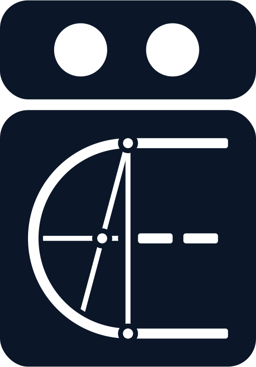

<p align="center">
  
</p>

# GraphRAG-Driven Agentic Reasoning: A Research Prototype using ADK, MCP, and Neo4j
**Case Study: Ancient Numismatics & the IN.IDEA Model**

**DOI: [10.5281/zenodo.19183341](https://doi.org/10.5281/zenodo.19183341)**

## Features & Capabilities

This prototype transforms a static Knowledge Graph into an interactive chat partner. Key capabilities include:
* **Agentic Graph Traversal:** The agent generates ad-hoc Cypher queries to navigate complex relationships without hardcoded paths.
* **Epistemic Reasoning:** Instead of just returning "facts," the system retrieves interpreted data, including scholarly confidence scores and evidence chains.
* **Multimodal Analysis:** Combines CLIP-based visual similarity with LLM-driven morphological analysis to identify and describe compositions.
* **Context-Aware Onboarding:** An MCP-driven onboarding process that injects the current graph ontology into the agent's context.
* **Efficiency-First Architecture:** Designed to interact with small-scale models (e.g., **Gemini 3.1 Flash Light Preview** with *Thinking: LOW*, or even *MINIMUM*). No expensive flagship models are required for this kind of reasoning - only high-quality, structured data (which is, admittedly, the hardest part to obtain).
* **Token-Optimized Communication:** Unlike many traditional RAG systems that flood the context window with verbose JSON, this system uses **"topological" Markdown** for detailed graph outputs (unit details) and **GraphQL schema definitions**. This drastically reduces token consumption while maintaining perfect legibility for the LLM.


## System Architecture

The system consists of four main components orchestrated via Docker:

* **Neo4j Database**: Stores the multi-layered Knowledge Graph and handles vector-based similarity searches for coin images.
* **FMA (Fast Model Adapter): FastAPI + MCP**: The core logic, providing a REST API via FastAPI and a **MCP Server** (Model Context Protocol)
* **FastAPI + Sentence Transformers**: A dedicated REST Endpoint using CLIP to generate 512-dimensional image vectors.
* **ADK**: A multimodal agent built with the Google Agent Development Kit (ADK) that uses Gemini models to reason over the graph data and ADK web for the UI.


### Directory Structure
```text
.
├── app/
│   ├── adk/            # ADK Agent definition ("Analyzer")
│   ├── embed/          # CLIP Embedding Service (FastAPI)
│   ├── fma/            # Graph-RAG Core & MCP Server
│   │   ├── lib/        # Logic: DB queries, MCP tools, Ontology
│   │   └── templates/  # Visual Catalogue UI
│   └── neo4j/          # Database migrations & raw import scripts
├── build/              # Dockerfiles
├── docker-compose.yml  # Orchestration
└── import-data.sh      # Data ingestion script
```


## Scope

### The Research Project
This work is part of our long-term research project **"[Imagines Nummorum" (2025–2049)](https://www.imagines-nummorum.eu/en)** at the **Berlin-Brandenburg Academy of Sciences and Humanities (BBAW)**. Our mission is to create a comprehensive iconographic thesaurus of ancient Greek coinage. Beyond mere data collection, we aim to document the complexity of scientific discourse and develop research tools that transcend the field of numismatics. In line with current technological shifts, we explore the opportunities and limitations of Artificial Intelligence, striving for a sovereign and responsible application of AI in the humanities.

### Purpose of this Prototype
This prototype demonstrates that **genuine reasoning** is achievable even with smaller LLMs, provided they are supported by a high-quality data foundation. Rather than simulating "reasoning" via massive flagship models on poorly structured data, we focus on the **transparent modeling of uncertainties and provenance** within the scientific discourse. 
* **The Agent as an Analyzer:** The AI does not replace the researcher; it acts as an Analyzer operating within the strict guardrails provided by the Knowledge Graph (RAG).
* **Development Context:** This setup was built in a **50-h-sprint** with heavy AI assistance. Approximately 90% of the Python code was generated by Gemini 3.1 Pro (explaining the mix of German and English comments). However, the underlying architecture and directory structure were manually designed.
* **Proof of Concept:** While many limitations remain, we believe a hands-on functional prototype is more valuable than an [abstract architectural sketch](https://github.com/imagines-nummorum/idea-graph-framework/blob/main/docs/05_trustworthy-ai.md) for demonstrating theoretical feasibility.

### The Graph Model (IN.IDEA)
The system is powered by an experimental evolution of the **[IN.IDEA Graph Framework](https://github.com/imagines-nummorum/idea-graph-framework)** (published in January 2025). The model is designed to be modular and strictly domain-agnostic. While developed for ancient coins, the framework can be adapted to other disciplines with minimal effort. 

**Key Features of the Graph Model:**
* **Axiomatic Schema:** Crucial for enabling effective zero-shot interaction between the LLM and the Graph. (see [schema.graphql](app/fma/lib/mcp/definitions/schema.graphql))
* **4-Layer Architecture:**
    1.  **Uni/Carrier Layer:** Physical representation of the object.
    2.  **Formal Analysis Layer:** Descriptive data and attributes.
    3.  **Epistemic Layer:** Scientific interpretations and knowledge.
    4.  **Ontology Layer:** Higher-level conceptual definitions.
* **Reification:** The model utilizes reified nodes for **Interpretations, Reasoning steps, Agents, and Sources**, ensuring every claim is traceable and debatable.


## Prototype Status & Critical Limitations

This project is a **Proof of Concept (PoC)** demonstrating the integration of the **[IN.IDEA Graph Framework](https://github.com/imagines-nummorum/idea-graph-framework)** as an external "Ground Truth" for AI agents. It is designed strictly for local research and testing; it is **not production-ready** and would require a fundamental re-architecture for public deployment.

### Security & Access Control
* **No Authentication:** The backend services (FastAPI, Neo4j, MCP) have no authentication layer. Anyone with network access to the ports can interact with the services.
* **Raw Cypher Execution:** The MCP tool `read_graph` allows the agent to execute raw Cypher statements. While there is a rudimentary regex-based suppression for write-operations (e.g., `CREATE`, `DELETE`), it is **not bulletproof**. 
    * *Note:* In a production environment, a read-only database user would be mandatory (as a minimum). This is currently not implemented due to limitations in the Neo4j Community Edition.
* **Resource Exhaustion:** There is no query validation or timeout management. A complex, recursive Cypher query could potentially lock the database or exhaust system resources (you will easily encounter this if you force the agent to do so)

### Scalability & Context Window Management
* **Missing Aggregation Logic:** The prototype currently lacks a strategy for handling large result sets. If a graph query (via `read_graph`) returns dozens or hundreds of units, the resulting payload will inevitably bloat or overflow the LLM's context window (although the unit details are already reduced in terms of token consumption). 
* **The "Context Ceiling":** To make this system usable with real-world data volumes, intermediate reasoning steps or "Map-Reduce" style architectures are required. 
    * *Future Solution:* Implementing pre-aggregated summaries, hierarchical retrieval (e.g., first summarizing clusters of units), or a "ranking" layer that selects only the top-N most relevant units for the final reasoning step.
* **Optimization vs. Volume:** The current implementation is optimized for **high-depth precision** on a small scale, not for **high-volume breadth**.

### Computer Vision & Embedding Methodology
* **CLIP Unsuitability:** The utilized CLIP model is **methodologically unsuitable** for ancient numismatics. Due to the specific materiality, stylistic heterogeneity, and semantic ambiguity of ancient coins, two iconographically identical but differently corroded or photographed coins may result in widely divergent vectors (vice versa).
* **The "Glass Box" Problem:** Relying solely on embeddings for similarity violates the intended "Glass Box" principle of explainable AI. While a morphological analysis via LLM could generate structured queries to support the visual similarity search, this would lead to excessive noise in large-scale datasets (>100k units).
* **Future Requirements:** Specialized models (e.g., incorporating *Shape from Shading*) are required for scientific accuracy. CLIP is used here strictly for **setup demonstration**. 
    * *Recommendation:* To see a successful interaction, prompt the Agent to analyze suited images, e.g. [**CN Coin 6900**](https://data.corpus-nummorum.eu/storage/coins/6900/img/7957/o/thumbnails/lg.jpeg). In 99.9% of other cases, visual retrieval results will likely be disappointing.

> [!IMPORTANT]
> **Call for Collaboration: Let's build a better Vision Model!**
> We are acutely aware of the "CLIP-gap" in cultural heritage. If you are an ML researcher or developer interested in building specialized models (e.g., Shape from Shading, fine-tuned Contrastive Learning for materiality), we invite you to collaborate. 
> We have a treasure trove of **>85,000 highly curated, professionally photographed, and clipped (masked) coin images** at our fingertips, including a unique subset of **>2,000 units captured as both the original coin and its plaster cast** (providing perfect ground truth for feature extraction) + meta data. We are able to provide even more data for the right research approach—let’s talk!

### Data & Ontology
* **Small Sample Size:** The database contains only **two(!) curated datasets**. We intentionally avoided synthetic "fixtures" to prevent simulating a "pseudo-science" environment. Annotation of further units is ongoing. We hope to provide at least 100 real-word examples soon (mapping legacy plain text coin descriptions and reconstructing the discourse is time consuming).
* **Experimental Schema:** This prototype uses an expanded, experimental version of the **IN.IDEA model** (v0.9.4 + preview of the numismatics-module: coin-specific nodes in the Object Layer). The schema is volatile and subject to change.
* **Onboarding Scalability:** Currently, the full Concept Ontology is passed within the MCP onboarding prompt. This works for few datasets but will hit context window limits as the data grows fast. A separate retrieval logic for the ontology will be required.

### Technical "Side-Car" Hack
* **ADK Image Ingest:** The tool `get_similar_units_by_image()` needs a workaround to enabled desired functionality: Since the ADK web interface (to our knowledge) does not provide a direct intercept for uploaded images to the MCP server, we **mount the ADK session directory into the FMA container (to access the `session.db`)**. 
* The system reads the latest image provided directly from the agent's session database to avoid redundant token usage and complex re-uploads. This is a functional "hack" to bypass framework limitations without monkey-patching the ADK core. However, there is a staging mechanism for images implemented in the FMA service.


## Hands-on: Setup & Installation

> [!TIP]
> **Can't run it locally?** I have documented the workflow—complete with screenshots and agent reasoning chains **[here](https://resonism.substack.com/p/real-reasoning)**.

### Prerequisites
* Docker
* **Google AI Studio API Key**: You can obtain one for free in the [Google AI Studio](https://aistudio.google.com/) (please note the limitations of the free Tier).

### Port Mapping Warning
> [!CAUTION]
> This prototype uses **hardcoded port mappings**. The following ports must be available on your host machine:
> * **Neo4j:** `7474` (HTTP), `7687` (Bolt)
> * **App Services:** `8000` (ADK web), `8001` (FMA/MCP) and `8002` (Embed Service) 
> * **More flexible setup:** a more flexible version, allowing port configuration via `.env` is planned

### Environment Configuration
Create a `.env` file in the root directory:
```
GOOGLE_API_KEY=your_key_here
```

### Deployment
1.  **Start the containers:** (might require sudo)
    ```
    docker compose up --build
    ```
2.  **Import the dataset:** (might require sudo)
    ```
    bash ./import-data.sh
    ```
3.  **Access the services:**
    * **ADK web:** `http://localhost:8000`
    * **MCP SSE Endpoint:** `http://localhost:8001/mcp/sse`
    * **REST Endpoint:** `http://localhost:8001/docs`
    * **Onboarding Prompt:** `http://localhost:8001/prompts/onboarding`
    * **Example Unit Output:** `http://localhost:8001/data/units/5`
    * **Data overview:** `http://localhost:8001/catalogue`
    * **Embedding Endpoint:** `http://localhost:8002/docs`
    * **Neo4j Browser:** `http://localhost:7474` (Credentials: `neo4j/password`)

### Headless Setup
The MCP can, of course, be used by **any** agent, meaning the ADK container is not strictly required. In this case, however, the agent must be prepared accordingly, as onboarding alone might not suffice for the desired functionality. Furthermore, `get_similar_units_by_image()` works exclusively with the provided ADK and the *[Analyzer](app/adk/Analyzer/agent.py)* agent. Other agents can use the staging mechanism and obtain an asset id, though this has not yet been tested. See [tools directory](app/fma/lib/mcp/tools) for available MCP tools or let your agent explore the MCP endpoint itself.

### Guided Tour: Testing the Prototype
To experience the full potential of the GraphRAG setup, we recommend the following workflow:

1.  **Initialize the Agent:** Open the ADK web interface at `http://localhost:8000`. Start by greeting the agent and asking about its functions. 
    * *Technical Note:* The agent is instructed to trigger `get_onboarding_prompt` immediately to load the graph schema. However, the agent might occasionally skip the "introduction" and jump straight to work.
2.  **Spatiotemporal Queries:** Ask a specific research question, such as: *"Which coins in the database were minted before 1 BC?"* 
    * Watch the logs to see the agent utilize the `read_graph` tool to write and execute a Cypher query on the fly.
3.  **Deep Dive:** Once a result is found, ask for details. The agent will use `get_unit_by_id` to synthesize the full epistemic context (citations, weight, material, and interpretations).
4.  **Visual Analysis:** Upload a test image (e.g., **[CN Coin 6900](https://data.corpus-nummorum.eu/storage/coins/6900/img/7957/o/thumbnails/lg.jpeg)**). The agent will use `get_similar_units_by_image`. 
    * *Note:* The agent is trained to prioritize a **morphological analysis** first. The CLIP-retrieved visual parallels serve as a reference, not an absolute truth. Given the limitations of general-purpose CLIP models for numismatics, the agent will (and should) treat these results with scientific skepticism.


## Available Agent Tools
The **Analyzer Agent** has access to specialized tools via MCP:
* `get_onboarding_prompt`: Retrieve the initial prompt (containing the graphql-schema)
* `read_graph`: Perform raw Cypher queries against the read-only graph.
* `get_unit_by_id`: Fetches the full epistemic context (interpretations, citations, evidence) for a specific coin.
* `get_similar_units_by_image`: Uses the current session's image to find visual parallels in the database.


## Model Experience
During development, we evaluated two different models to find the sweet spot between logical precision (Cypher) and qualitative synthesis (Numismatic analysis).

* **Gemini 2.5 Flash:**
  * **Pro:** Excellent at generating ad-hoc Cypher queries on the fly. Very reliable for structured data retrieval.
  * **Con:** The linguistic style was somewhat "stiff" and "robotic." It occasionally struggled with deep, qualitative interpretations of the graph, remaining on a more superficial level of analysis.
* **Gemini 3.1 Flash Light Preview:**
  * **Pro:** Even more cost-effective than its predecessors. It produces significantly more cohesive, "human-like," and stylistically pleasing summaries.
  * **Con:** It can be slightly over-ambitious with Cypher queries. It occasionally adds too many constraints to a query, which can lead to empty result sets if not carefully prompted. While its style is better and less superficial, the model tends to mix relations from time to time (better prompting should solve this).

> [!IMPORTANT]
> The current system prompts are in a continuous state of optimization. While functional, they are not yet fully "hardened".


## Author & Governance
This prototype is open-sourced software created and maintained by [Jan Köster](https://orcid.org/0000-0003-2713-5207) and licensed under the [Apache 2.0 license](LICENSE.txt) for the Academy Project ["Imagines Nummorum"](https://www.bbaw.de/en/research/imagines-nvmmorvm-thesaurus-iconographicus-nummorum-graecorum-online) at the [Berlin-Brandenburg Academy of Sciences and Humanities](https://www.bbaw.de/en/). This project  is part of the "Akademienprogramm", funded by German federal and state governments, which serves to preserve, secure and make present our cultural heritage.
It is coordinated by the [Union of German Academies of Sciences and Humanities](https://www.akademienunion.de/).

**Contact:** For any app related topic we prefer direct communication on Github, for any contact to our initiative, see [Contact](https://www.imagines-nummorum.eu/en/contact)


## Citation

```bibtex
@software{koester_jan_GraphRAG-Driven_Agentic_Reasoning_2026,
  author       = {Köster, Jan},
  license      = {Apache-2.0},
  title        = {{GraphRAG-Driven Agentic Reasoning: A Research Prototype using ADK, MCP, and Neo4j}},
  month        = mar,
  year         = {2026},
  publisher    = {Zenodo},
  version      = {v0.1.0},
  doi          = {10.5281/zenodo.19183341},
  url          = {https://doi.org/10.5281/zenodo.19183341}
}

```

## AI Transparency & Methodology
In alignment with the epistemological focus of this project, transparency regarding the creation process is paramount. This prototype was developed with the assistance of **Google Gemini 3.1 Pro** for Coding and **3.0 Thinking** for brainstorming.

The AI's contribution included the following areas:

* **Coding:** ~ 90% of the Python code was written by AI
* **Conceptual Brainstorming:** Exploratory dialogue to refine the concept of the app.
* **Best Practices Integration:** Research and suggestions for adapting established patterns.
* **Drafting Support:** Generating initial outlines and structural sketches

**Note on Authorship:** While the AI provided support as described above, all final decisions, code implementations, and text formulations were curated, verified, and finalized by the maintainer mentioned above. The AI acted solely as an assistive tool, not as an autonomous agent/co-author.

## Disclaimer & Responsibility

> [!WARNING]
> **Monitor your API Usage:** Please keep a close eye on your Google AI Studio / Vertex AI API statistics and costs while using the Analyzer Agent. 
> * **Token Consumption:** Theoretical malfunctions, logic loops, or unforeseen recursive queries could lead to high token loads. 
> * **No Warranty:** This is a **technical demonstration** and a research prototype, not a consumer-ready application. 
> * **Usage Risk:** Any use of this software, including the consumption of paid API credits, is strictly at your own risk. No warranties or guarantees of any kind are provided.

## Open Source & Contribution

**Feel free to fork, modify, and repurpose this codebase!**  
We explicitly encourage the research community and fellow developers to adapt this Software pattern for their own domains.

While this specific prototype will remain a PoC for the foreseeable future, we are actively preparing the full integration of the **IN.IDEA Graph Framework** into our long-term research services.

Your feedback is highly welcome! We are currently in a phase where the architecture is still agile and easy to adapt. If you have suggestions for technical improvements, architectural refinements, or ideas on how to adapt the framework for other research domains, please do not hesitate to share them.

Please use the **[IN.IDEA Repository](https://github.com/imagines-nummorum/idea-graph-framework)** for any conceptual feedback.
